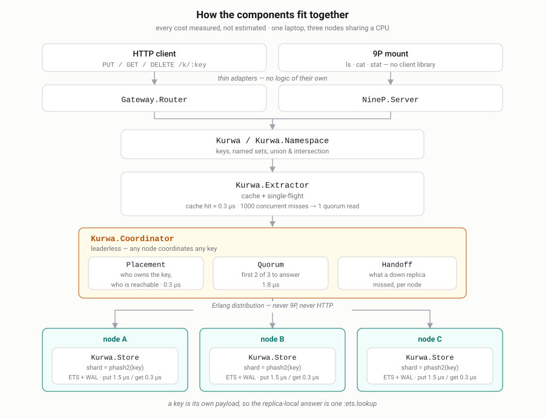
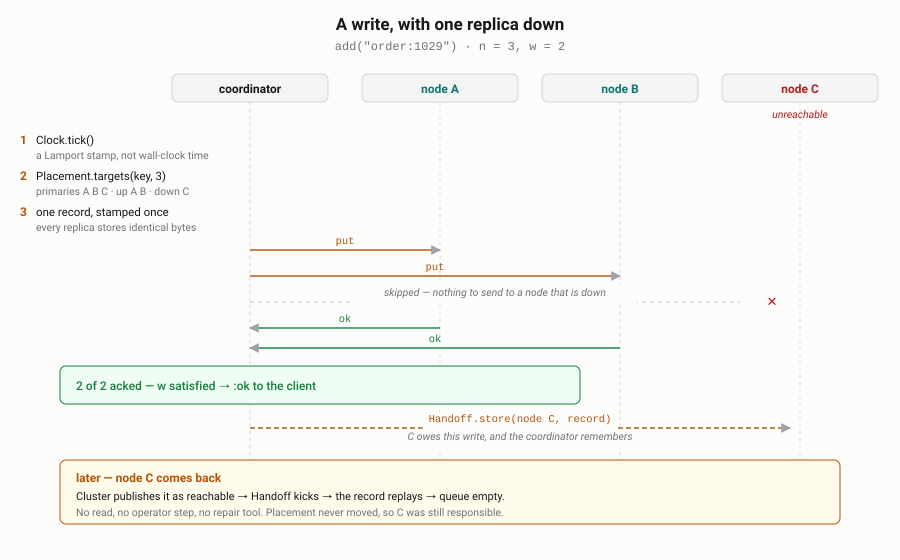

# ADR 0001: A key-only distributed set

* **Status:** accepted
* **Date:** 2026-09-26
* **Supersedes:** nothing

This record is deliberately one-sided: it argues the case *for* kurwadb, which is
what an advocacy ADR is for. The costs of the same decision — LWW semantics, no
scans, the tombstone TTL, the RAM ceiling — are recorded in
[ARCHITECTURE.md](../../ARCHITECTURE.md) and are not repeated here.

Every number below was measured on this codebase (Elixir 1.20 / OTP 29, one
laptop, all three nodes sharing the same CPU), not estimated.

## Context

A recurring need: *"have I already seen this key?"*, at cluster scale, with an
honest answer. Deduplication, idempotency keys, rate-limit buckets, blocklists,
seen-URL frontiers, replay protection.

Every general-purpose store can do this, and each one charges for generality it
does not need here: a value to store, a leader to elect, a merge to resolve, a
scan to avoid, a JVM to tune. kurwadb takes the opposite route — it supports
exactly one data type, the key, and spends the freedom that buys.

## Decision

Build a distributed set. `add`, `member?`, `delete`, `count`. No values, no
scans, no queries, no indexes, no leader.

## Why this is better, claim by claim

### 1. Conflict resolution stops being a problem instead of being solved

With no values, two concurrent writes to a key cannot disagree about anything but
existence, so the merge is a total order on `{lamport, node}`:

```elixir
def merge(a, b), do: if newer?(a, b), do: a, else: b
```

Commutative, associative, idempotent. Two replicas that saw the same writes agree
in any order with no coordination.

| | what the application has to do |
|---|---|
| Riak KV | read the vector clock, handle siblings, supply a merge function |
| Cassandra / Scylla | reason about per-cell timestamps and `gc_grace_seconds` |
| DynamoDB | conditional writes, and version attributes to detect conflict |
| Redis Cluster | nothing — but a failover window can drop acknowledged writes |
| **kurwadb** | **nothing. The merge is closed over the data model** |

Per-key metadata is four fixed fields and does not grow with the cluster or the
write history — unlike a vector clock, which grows with the number of actors that
ever touched the key.

### 2. Any node answers any request

There is no leader, so there is no election, no failover pause, and no write
funnel. Losing a node removes capacity, not availability.

Compare the mechanism, not the benchmark: etcd, Consul and ZooKeeper route every
write through a Raft leader and stop writing during an election; Redis Cluster
owns each slot with one master and promotes a replica on failure; PostgreSQL has
one primary. kurwadb coordinates a quorum from whichever node the client happened
to reach.

**Measured**, three nodes, `n=3 r=2 w=2`, one coordinating node, 64 concurrent
clients:

| | |
|---|---|
| `add` (quorum write, 2 of 3) | 54 300 ops/sec |
| `member?` (quorum read, 2 of 3) | 59 100 ops/sec |
| single-client latency, either | ~47 µs |

### 3. A replica that was away catches up by itself

The ring is built from every node the cluster has verified, not from the nodes
that are reachable, so a key's replicas do not move when a node blinks — and the
absent replica stays responsible for what it missed. Writes it could not take are
queued and replayed when it returns.

**Measured** (an automated test, `mix test --include cluster`): three nodes, 5
keys written, one node stopped, 5 more keys written and accepted at `w=2`, 5 hints
queued. Node restarted → 10 keys on all three nodes, queue empty, **no reads
issued**. No operator step, no repair tool, no nodetool.

### 4. A membership check does not leave the node unless it must

A key is its own payload, so the replica-local answer is one `:ets.lookup` in the
caller's own process — no mailbox, no copy, no serialisation.

| | measured |
|---|---|
| local membership check, one process | **365 ns** |
| the same, 64 concurrent clients | **2.0M ops/sec** (on a node also serving two other replicas) |
| full quorum read across 3 nodes | 2.8 µs of kurwadb + one network round trip |
| full quorum write across 3 nodes | 4.9 µs of kurwadb + one network round trip |

The 2.8 / 4.9 µs are the CPU cost with replication logic included; on a single
node that is the whole operation. Everything else is the network you would pay
with any distributed store.

### 5. An unreachable replica cannot be mistaken for an absent key

This is the failure mode that makes cache-based deduplication quietly wrong: when
Redis is unreachable or the entry was evicted, "not found" and "cannot tell" look
identical, and the duplicate goes through.

kurwadb never conflates them. A quorum that cannot be reached is an error —
`503`, with which replicas failed and why — and never a `false`. `strict_quorum`
decides whether a shrunken cluster serves at reduced durability or refuses; either
way the answer is never a guess.

### 6. Set algebra with no data movement

Named sets compose at read time. A union is not a set you maintain, it is a way of
asking:

```elixir
Kurwa.Namespace.member_any?(["blacklist", "greylist", "tenant:42"], key)
```

Each set is a separate quorum read, they run concurrently, and the first `true`
settles it. No materialised union to keep in step, no view to refresh, nothing
copied. (The idea is Plan 9's union mount, which is exactly set union when the
files have no contents.)

### 7. One core, several protocols — including one that needs no client library

The core is protocol-neutral, so frontends are thin adapters. Two exist: HTTP,
and 9P2000, where the store mounts as a filesystem and `stat` *is* `member?`:

```sh
9p -a localhost:564 read ring     # membership, up/down, quorum settings
echo compact | 9p -a … write ctl  # control files instead of admin endpoints
```

Administration and inspection with `ls`, `cat`, `stat` — no SDK, no REPL, no
vendor CLI. Adding the whole 9P frontend changed nothing in the replication core:
the commit is four new modules under `lib/kurwa/ninep/`, plus the supervision line
that starts the listener and the flag that guards it.

### 8. The operational surface is one OTP application

No external coordinator, no ZooKeeper, no JVM or GC tuning, no sidecar, no agent.
Membership rides on Erlang distribution, which already provides the mesh and the
up/down events. Every setting has a default, so it boots with no configuration
file at all, and the durability knob is one line (`wal_sync_on_write`).

### 9. The guarantees are asserted, not described

168 unit tests, plus 10 that boot three real distributed nodes and assert the
claims in this document: replication, cross-node reads, stable placement across an
outage, handoff, read repair, strict versus lenient quorums, and what a hard crash
costs. Running them is how two design holes were found and closed.

## How the components fit together

Every cost on this diagram was measured, not estimated.



<details>
<summary>plain-text version</summary>

```
   clients                                   operators
      │                                          │
      │ HTTP                                     │ mount / ls / cat / stat (9P)
      ▼                                          ▼
┌───────────────────┐                  ┌───────────────────┐
│  Gateway.Router   │                  │  NineP.Server     │   thin adapters:
│  /k /sets /union  │                  │  /keys /sets /ctl │   no logic of their own
└─────────┬─────────┘                  └─────────┬─────────┘
          └───────────────┬──────────────────────┘
                          ▼
              ┌───────────────────────┐
              │ Kurwa / Kurwa.Namespace│  keys, named sets, union & intersection
              └───────────┬────────────┘
                          ▼
              ┌───────────────────────┐
              │   Kurwa.Extractor     │  cache hit ≈ 0.3 µs, never leaves the node
              │   cache + single-flight│  1000 concurrent misses → 1 quorum read
              └───────────┬────────────┘
                          ▼
              ┌───────────────────────┐
              │  Kurwa.Coordinator    │  leaderless; any node, any key
              └───┬───────┬────────┬──┘
                  │       │        │
      Placement ◀─┘       │        └─▶ Handoff        queues what a down
      0.3 µs              ▼             (per node)    replica missed
      who owns the     Quorum
      key, who is up   1.8 µs
                       first 2 of 3
                          │
        ┌─────────────────┼─────────────────┐        Erlang distribution
        ▼                 ▼                 ▼        (never 9P, never HTTP)
   ┌─────────┐       ┌─────────┐       ┌─────────┐
   │ Replica │       │ Replica │       │ Replica │   node A, B, C
   │ Store   │       │ Store   │       │ Store   │   shard = phash2(key)
   │ ETS+WAL │       │ ETS+WAL │       │ ETS+WAL │   put 1.5 µs / get 0.3 µs
   └─────────┘       └─────────┘       └─────────┘
```

</details>

### A write, with one replica down

The interesting case is not the happy path — it is what happens to the replica that was not there.



<details>
<summary>plain-text version</summary>

```
  Kurwa.add("order:1029")            on whichever node the client reached
        │
        │ 1. Clock.tick()                    Lamport stamp, not wall-clock
        │ 2. Placement.targets(key, n=3)     primaries [A,B,C], up [A,B], down [C]
        │ 3. one record, stamped once        every replica stores identical bytes
        ▼
   Quorum.run([A,B], put, need=2)
        ├──▶ A  ETS insert + WAL append ──▶ ok
        └──▶ B  ETS insert + WAL append ──▶ ok
        │
        │ 2 of 2 acked, w satisfied
        ▼
   Handoff.store(C, record)          C was down, so it owes this write
        │
        ▼
      :ok  to the client

   ... later, C comes back ──▶ Cluster publishes it as up
                          ──▶ Handoff kicks, replays the record, queue empties
```

</details>

### A read, and how a stale replica gets fixed


<details>
<summary>plain-text version</summary>

```
  Kurwa.member?("order:1029")
        │
        ├─ Extractor: cached?  ──yes──▶  true            0.3 µs, no network
        │                     ──no───┐
        │                            ▼
        │                   single-flight: one caller resolves, the rest wait
        ▼
   Quorum.run([A,B,C], get, need=2)
        ├──▶ A  {alive, lamport 41}
        ├──▶ B  {alive, lamport 41}
        └──▶ C  (still answering, quorum already met — abandoned)
        │
        │ merge the answers: highest {lamport, node} wins
        ▼
   read repair ──▶ any replica that answered with something older gets the winner
        │
        ▼
      true

   quorum not reachable ──▶ {:error, {:quorum_not_met, …}} ──▶ 503, never false
```

</details>

The diagrams are generated by `scripts/diagrams.py`; edit that, not the SVG.

## Consequences

The advantages above all come from the same place: **the data model is closed.**
A key has no contents, so there is nothing to merge, nothing to serialise, nothing
to scan and nothing to elect a leader over — and that is what leaves room for
leaderless quorums, a 365 ns local read, a filesystem frontend and set algebra
that copies nothing.

The bill for it is in [ARCHITECTURE.md](../../ARCHITECTURE.md): last-writer-wins
resolution, no scans or listings, a tombstone TTL that must exceed your longest
outage, and roughly 11 GB of RAM per 100M keys until a disk engine lands.
